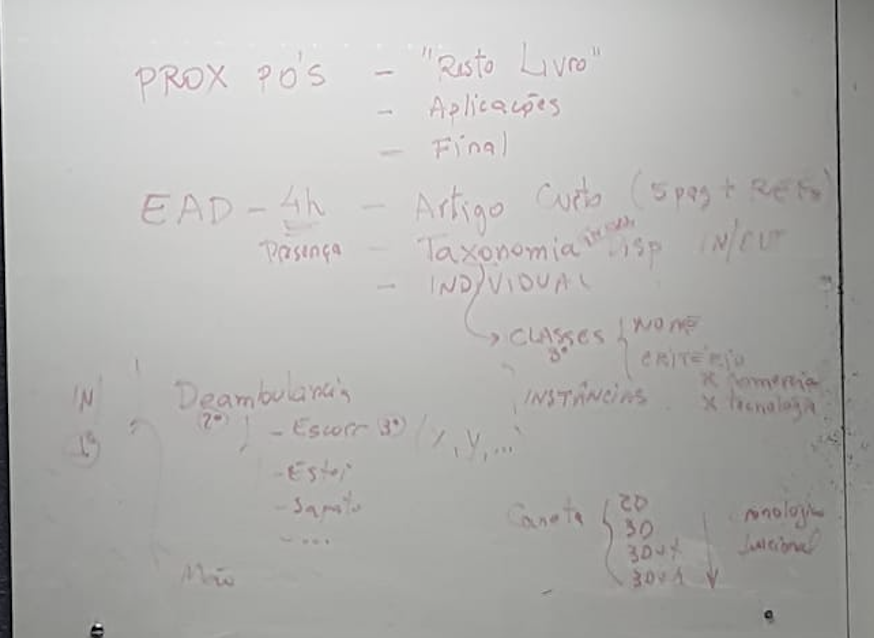

# UDESC - RV  

Horário: 15:10~16:50 .. 20 intervalo .. 17:10~18:50  
Moodle CCT  
Minha Biblioteca (acesso portal da UDESC)  
Conta CAFe: periódicos  
[marcelo.hounsell@udesc.br](mailto:marcelo.hounsell@udesc.br)

Formato escrito SBC  

Sala de Aula Invertida by Research  

Avaliação (360, um pouco de tudo): Participação, Comportamento, Conhecimento, Assiduidade e Qualidade  
Seminários, artigos escritos e trabalhos extras  

Pós: 15 encontros de 60 horas  

## 2025-03-10 - 15:38

Laboratoty for Research on Visual Applications + VINCO  
Laboratório LARVA -> F-111  
[LARVA Facebook](https://web.facebook.com/LARVA.UDESC/?locale=pt_BR&_rdc=1&_rdr)  

Journal on Interactive Systems (revista Qualis A4 Brasileira)  
Livro do Pré-Simpósio do SVR: [Livro](marginnote4app://note/E8767966-1DA4-4D96-B67E-9052CDBAF6E5)  
Parte 1: Conceitos  
Parte 2: Métodos, Técnicas e Tecnologias  
Parte 3: Aplicações (desatualizado)  

HP - Hiper Realidade  
XR - Realidade Estendida  
RV -  
RA -  
VA -  
JG -  
Gêmeo Digital - Industria 4.0  

Imersão  
Presença TODO: não tem esse conceito no conteúdo de RV  

Capítulo 1 pags. 11 a 26

## 2025-03-24

Continuamos discutindo sobre o livro da página 17 até o final.  

Path Find  
Way Find  

Imersão (hardware) - Interação (software) - Imaginação (usuário)  

Realidade Extendida seria a grande área .. RV

Programa = dados + algoritmo
Presença = imersão + envolvimento

Mão tem 22 DOFs
FPS > 60

## 2025-03-31 - 15:40

Atividade extra-classe X1: dados 2011-2024 (pto 0,10)  
Figura 2.1 e 2.2  
Moodle PPT

Islan

GPS -> LPS (Local Position System)  

## 2025-05-02 - 14:49

Congressos de RV

Nacional: SVR — Symposium on Virtual and Augmented Reality  

Internacional: IEEE VR (Virtual Reality Conference), ACM SIGGRAPH (Realidade Virtual, Realidade Aumentada e XR) e ISMAR (IEEE International Symposium on Mixed and Augmented Reality).  

## 2025-05-13 - 10:31

Próximos trabalhos:
  
