# Trabalho 3

Koleva, B., Benford, S., and Greenhalgh, C. (1999). **The Properties of Mixed Reality Boundaries**. Dordrecht: Springer. doi: 10.1007/978-94-011-4441-4_7  

Dalton Solano dos Reis  
professor: Marcelo da Silva Hounsell  
UDESC - Centro de Ciências Tecnológicas  

## Visão Geral

<!--    -->
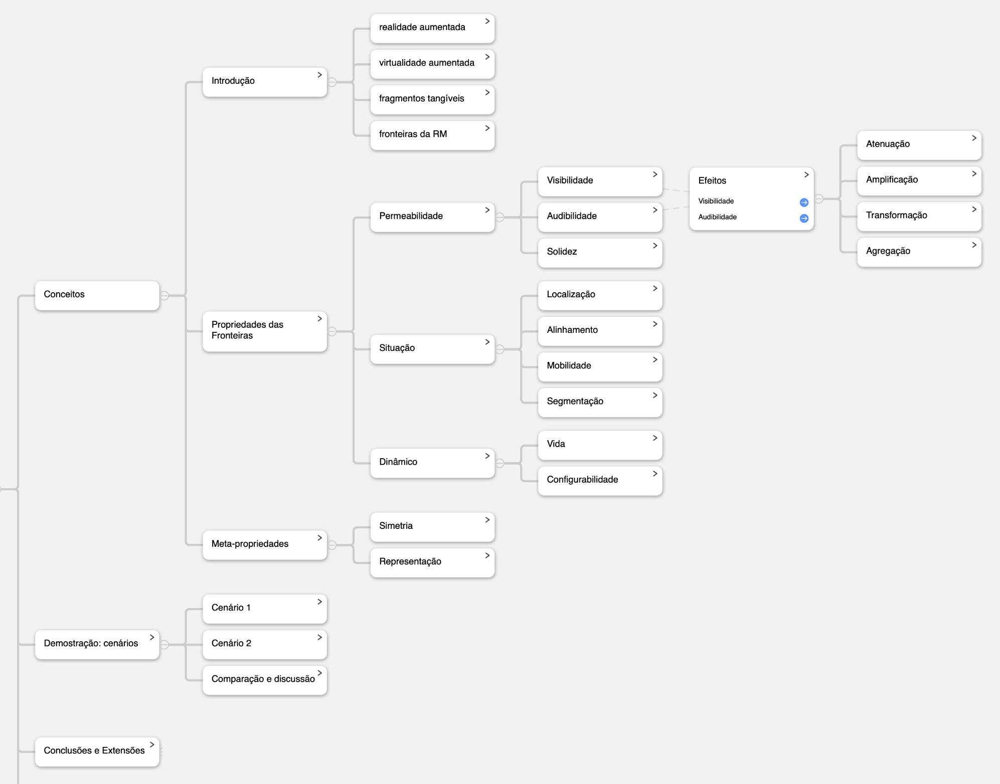

## Conceitos

### Introdução

As Propriedades das Fronteiras da Realidade Mista (RM):

- crescente interesse  em técnicas para combinar (diminuir a fronteira entre) ambientes reais e virtuais
  - fronteira "transparente"
- ambientes espaciais: participantes podem interagir com informações físicas e digitais de forma integrada
- RM compartilhadas: pessoas distribuídas por diversos espaços físicos e virtuais se comuniquem entre si
  - Computer-Supported Cooperative Work (CSCW)
- abordagens para criar RM:
  - realidade aumentada
  - virtualidade aumentada
  - fragmentos tangíveis (IUT): *phicons*
  - **fronteiras da RM**

- Simples fronteira de RM  
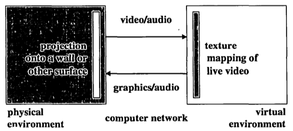

### Propriedades

Escolha dessas propriedades foi influenciada por analogias com as fronteiras do mundo real que dividem o espaço físico.  
Trabalho anterior: desenvolvimento de fronteiras dentro do espaço virtual (Benford *et al*., 1997a)  

#### Permeabilidade  

Descreve como a fronteira afeta a informação sensorial que passa entre os espaços conectados.  

##### Visibilidade  

- quais informações visuais são permitidas através da fronteira
- componentes:
  - resolução visual: quantidade de informação visual obtida por meio da fronteira (resolução e detalhe gráfico)
  - campo de visão: volume do espaço conectado que se torna visível através da fronteira (campo de visão e projetores)

##### Audibilidade  

- quais informações sonoras são permitidas através da fronteira
- fatores: posicionamento/sensibilidade (microfones) e taxas de amostragem

###### Efeitos  

Visibilidade e Audibilidade melhor descritas com a combinação desses efeitos:

- atenuação: reduzir a resolução (vídeo) ou volume (áudio);
- amplificação: projetar o áudio como em um sistema de som público
- transformação: distorcer áudio e vídeo para preservar o anonimato
- agregação (resumir): mostrar apenas o número de participantes remotos em vez de cada indivíduo

##### Solidez  

- capacidade de atravessar a fronteira nos dois sentidos (físico e virtual)  
- travessia do físico para o virtual: utilizar dispositivos de interação 3D e tecnologias de rastreamento para manipular objetos virtuais
- travessia do virtual para o físico: controle remoto de objetos reais
  - GestureCam (Kuzuoka *et al*., 1995)
  - Digital Desk (Wellner, 1993)
  - Clearboard (Ishii & Kobayashi, 1992)

#### Situação  

- relações espaciais, participantes e objetos desses espaços
- localização da fronteira: fixa e segmentada

##### Localização

- posicionamento da fronteira nos espaços
  - vertical: projeção (física) ou textura (virtual)
  - horizontal: mesa ou quadro (físico ou virtual)

##### Alinhamento

- orientação da fronteira em relação aos diferentes participantes e objetos
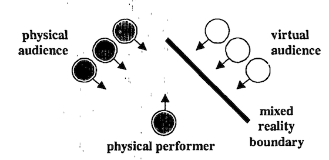

##### Mobilidade

- se a fronteira pode ser mover ao longo do tempo

##### Segmentação

- fronteira pode ser segmentada em termos de suas propriedades e de sua localização espacial

#### Dinâmico  

- propriedades temporais da fronteira

##### Vida

- duração de tempo que a fronteira existe

##### Configurabilidade

- quão dinamicamente as diversas propriedades da fronteira podem ser alteradas

### Meta-propriedades  

#### Simetria

- grau de similaridade entre físico e virtual
- grau de assimetria: imposto por tecnologias utilizadas

#### Representação

- participantes precisam compreender tanto as configurações atuais quanto as potenciais de suas propriedades
  - Por exemplo, o campo de visão de câmeras físicas e virtuais pode ser tornado visível ao ser marcado no chão

## Demostração: cenários

### Cenário 1: apresentação artista

Palco virtual interage com um público em um teatro físico por meio de uma fronteira de realidade mista
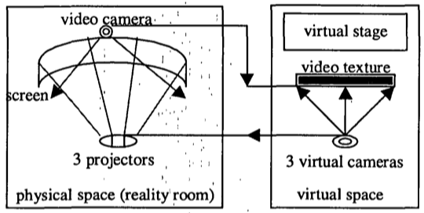  

### Cenário 2: "porta" de escritório

Conexão entre um mundo virtual público e um escritório físico privado.
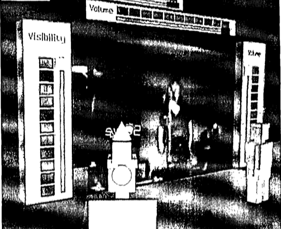  

### Comparação e discussão  

- Resumo das propriedades nos dois cenários  
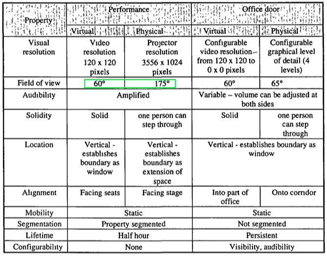  

## Conclusões e Extensões

- Maximizar a implementação das propriedades de fronteira  
- dificuldade de criar limites não sólidos  
  - participante ir do real para o virtual (teatro - projetar imagens na cortina vertical de água)  

Exemplo SVR 2002: cidade real "ligada" com cidade virtual por um carro que atravessava em "túnel".  

Estudo dessas propriedades podem ajudar no desenvolvimento de novas técnicas para unir os domínios do espaço físico e digital

## Referências Relacionadas

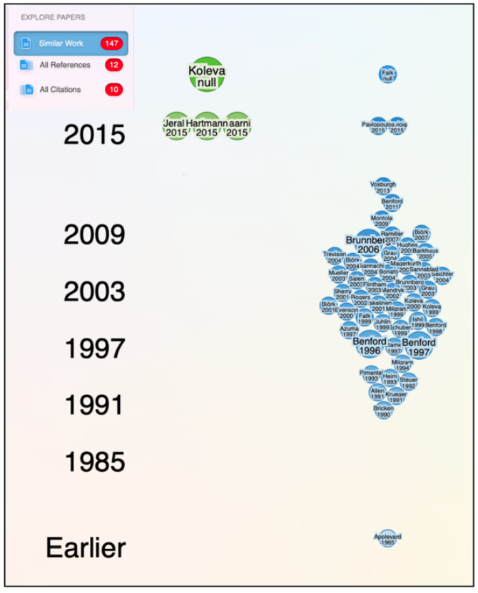  

## Mais exemplos

### Aquário Virtual: Multiplayer e Realidade Virtual

Matheus Waltrich da Silva, Dalton Solano dos Reis – Orientador  
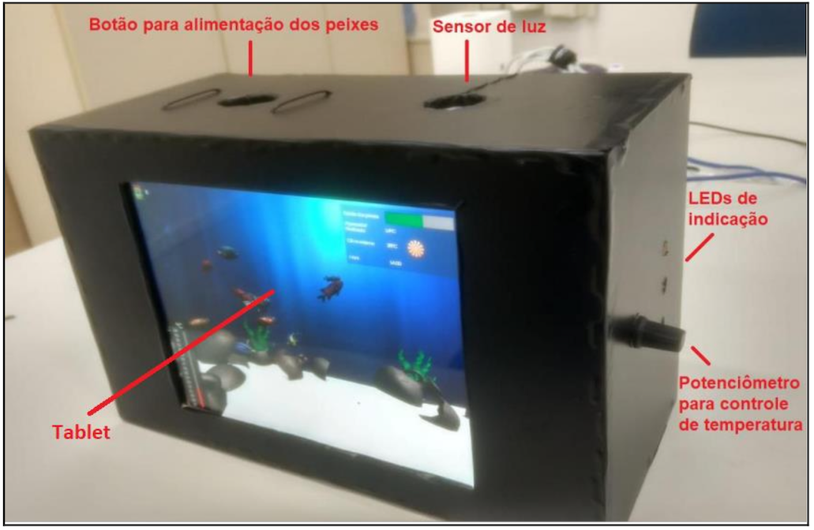  
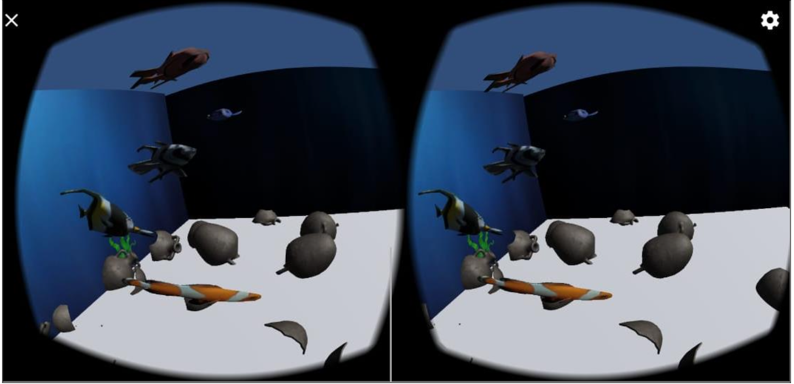  
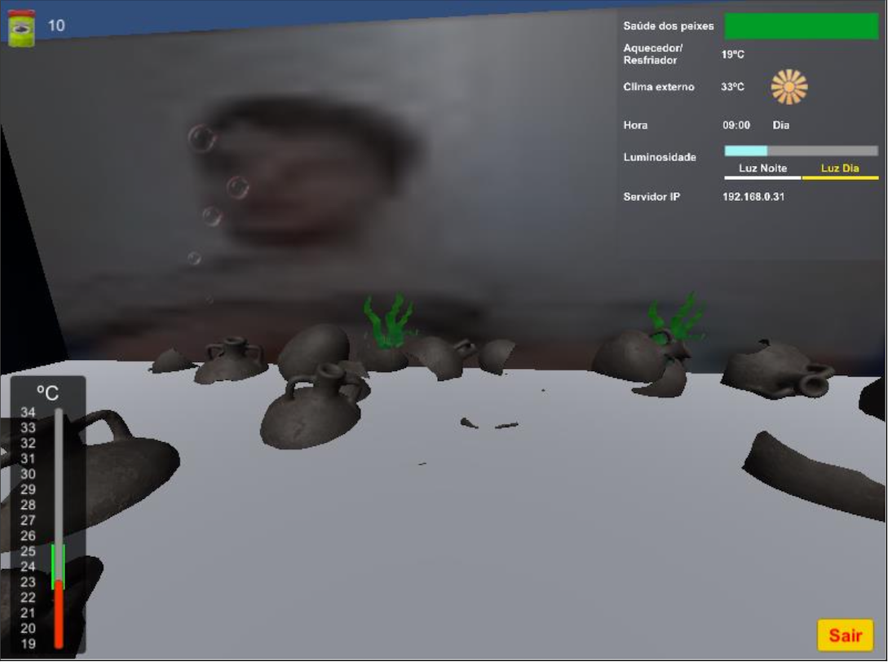  
Fonte: <https://github.com/gcgfurb/tcc_MatheusWaltrichDaSilva/blob/master/textos/tcc_bcc_2020_1_matheuswaltrich_MatheusWaltrichDaSilva-VF.pdf>  

### Defesa Civil

Projeto Pesquisa  
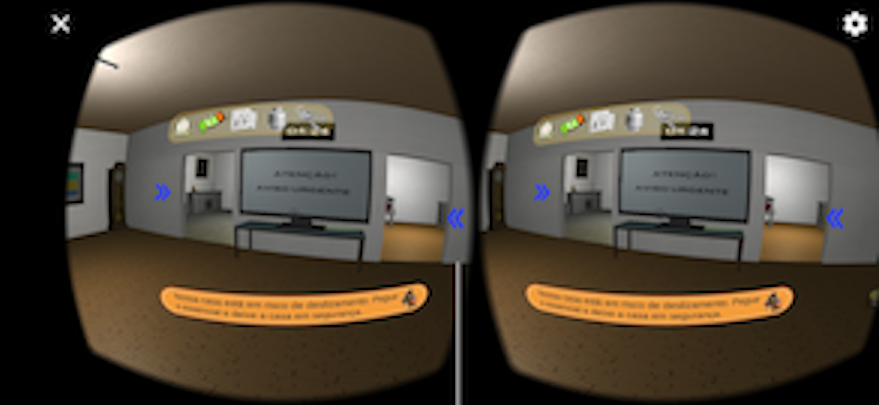  
