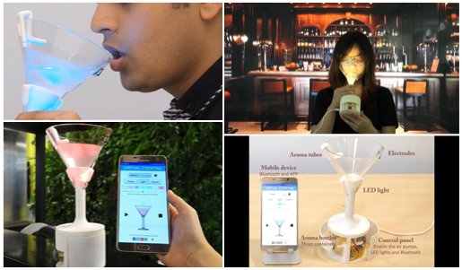

# Trabalho 4 - Interfaces Gustativas

Os Slides estão em: [slides.pdf](Slides/slides.pdf)

## Pesquisa

### Enunciado

Dalton S. dos Reis  
**Paladar**  

Luciana P. A. Kohler  
Olfato (relação forte com o **paladar**)  

Nathália Miranda  
OUTPUT-5. Other Senses  
a. Fone de Ouvido Háptico \[Razer] Nari Ultimate, 2018  
b. Olfato  
c. **Paladar**  

A a experiência **gustativa** humana, que envolve também olfato e textura.  

### Livro

TORI, R.; HOUNSELL, M. DA S. Introdução a Realidade Virtual e Aumentada. \[s.l.] Sociedade Brasileira de Computação, 2020.  

Pag. 52 __  
2.7.5 Realidade Cruzada (RC) e Virtualidade Ubíqua (VU)  O uso de dispositivos de RV, como luvas hápticas por exemplo, permite que o usuário sinta o mundo virtual “na pele” (literalmente). Feedback háptico de toque, força, colisão, temperatura e até cheiro e **paladar** têm sido alvo de investigações e produtos inovadores. Entretanto, quando na Realidade Misturada se tem ações no mundo virtual que repercutem no mundo real, daí tem-se a Realidade Cruzada (RC), ou no inglês, Cross Reality (XR).  
-> **paladar** têm sido alvo de investigações e produtos inovadores  

Pag. 153 __  
O aumento da complexidade do Software gera o aumento da complexidade do hardware, assim, olhando apenas para o ramo “comportamento social” da Figura 9.3, nota-se claramente que o hardware a ser utilizado é diferente para cada situação. A sensibilidade, o odor e o **paladar** estão longe de ser experimentados pelos viajantes em mundos virtuais, mas não se é permitido tecer limitações quando se quer representar o ambiente real, assim, se nesta fase não é possível obter alguns efeitos, certamente eles deverão ser alcançados no futuro. Essas são as buscas dos cientistas das próximas gerações.  
-> A sensibilidade, o odor e o **paladar** estão longe de ser experimentados pelos viajantes em mundos virtuais  
-> Essas são as buscas dos cientistas das próximas gerações  

Pag. 191 __  
Nesse contexto, os desenvolvedores de sistemas de RV e RA também devem levar em consideração os canais sensoriais do usuário na implementação de técnicas de interação. Os canais sensoriais de visão, audição e tato têm sido explorados, especialmente o primeiro; em contrapartida, olfato e **paladar** ainda não são pesquisados amplamente.  
-> olfato e **paladar** ainda não são pesquisados amplamente.  

Pag. 407 __  
Também permite maior interação quando se utiliza acessórios para aumentar a percepção dos cinco sentidos do ser humano (audição, visão, tato, **paladar**, olfato).  
-> acessórios para aumentar a percepção  

## Conceitos

### Visão geral

Existem dispositivos experimentais de **paladar** para Realidade Virtual (VR), mas ainda estão em estágios iniciais de desenvolvimento e não são amplamente disponíveis como os dispositivos visuais, auditivos ou táteis (hápticos).  

Apresentam em dois grupos, dos sentidos:

- visão, audição e tato  
- olfato e palar  

### Dispositivos de paladar em VR (Taste Interfaces - Interfaces de Sabor)  

Esses dispositivos tentam simular sabores usando diferentes **métodos**, como:  

#### 1. Estimulação elétrica da língua

- Pequenos eletrodos são colocados na língua para estimular os receptores gustativos.  
- Conseguem simular sensações como azedo, salgado, doce ou metálico.  

#### 2. Estimulação térmica  

- Mudanças de temperatura na boca afetam a percepção do sabor.  
- Alguns dispositivos usam calor e frio para simular, por exemplo, sensações como picante ou refrescante.  

#### 3. Sprays ou cartuchos de aroma e gosto

- Pequenos dispositivos liberam aromas ou microgotas com sabor sincronizados com a experiência VR.  
- Pode ser acoplado a fones de ouvido ou óculos VR.  

#### 4. Realidade gustativa combinada

- Combina realidade aumentada com alimentos reais — por exemplo, comer algo neutro (como um biscoito sem sabor), enquanto o sistema altera visualmente e aromaticamente o alimento, convencendo o cérebro de que é algo diferente.  
  
### Exemplos de dispositivos  

- Digital Lollipop  
- Vocktail (Coquetel)  
- Project Nourished  
- e-Taste  
- Meta Cookie+  
- Thermal Taste Actuator  
- Taste Display Synthesizer  
- AR Taste Enhancers  
- Mixed Reality Kitchen  
- Virtual Sweet Spoon  
- Electric Taste Machine  
- Taste+ Project  
- Augmented Gustation  
- Multisensory XR System  

#### Digital Taste Interface (DTI) - Digital Lollipop

- Desenvolvedor: Nimesha Ranasinghe e equipe na Universidade Nacional de Singapura (NUS).  
- Funcionamento: utiliza estimulação elétrica e térmica na língua para simular os quatro sabores básicos: doce, salgado, azedo e amargo.  
- Aplicações: além de entretenimento, tem potencial para auxiliar pessoas com restrições alimentares, como diabéticos, ao simular sabores sem a ingestão real de açúcar.  
- Dispositivo:  utiliza eletrodos de prata posicionados na ponta da língua para aplicar correntes elétricas de baixa intensidade, com variações de magnitude, frequência e polaridade.  
- Explora o conceito: **Taste Over Internet Protocol** (TOIP), visando transmitir informações gustativas digitalmente entre locais distintos.  
- Ano: 2013 (protótipo inicial).  

[DigitalLollipop](./DigitalLollipop.md)  

#### Vocktail (Virtual Cocktail)

Modifica sabor da água com estímulos elétricos e LED, além de aroma.  
O Vocktail (Virtual Cocktail - Coquetel) é um dispositivo interativo desenvolvido por Nimesha Ranasinghe e sua equipe no Keio-NUS CUTE Center, projetado para simular experiências multissensoriais de sabor. Ele combina estímulos visuais, gustativos e olfativos para alterar a percepção do sabor de bebidas, permitindo que, por exemplo, água simples seja percebida como um coquetel saboroso.  
Ano: 2017.  

O Vocktail consiste em uma taça integrada a uma base impressa em 3D, que abriga os componentes eletrônicos responsáveis pela estimulação multissensorial. O sistema utiliza três modalidades sensoriais para criar sabores virtuais:  

- estímulo visual: LEDs RGB projetam luzes coloridas na bebida, influenciando a expectativa de sabor.  
- estímulo gustativo: eletrodos de prata na borda da taça aplicam correntes elétricas controladas na ponta da língua, simulando sensações de salgado, azedo ou amargo.  
- estímulo olfativo: microbombas de ar liberam aromas de cartuchos substituíveis diretamente sobre a bebida, afetando a percepção olfativa.  

O dispositivo é controlado por um aplicativo móvel via Bluetooth, permitindo que os usuários personalizem as combinações de sabor, aroma e cor, salvem predefinições e compartilhem suas criações com outras pessoas.  

  
  

#### Project Nourished

- Desenvolvedor: Jinsoo An e equipe.  
- Objetivo: criar experiências gastronômicas virtuais que proporcionem prazer e satisfação sem calorias ou impacto no açúcar no sangue.  
- Funcionamento: utiliza alimentos comestíveis de baixa caloria impressos em 3D, difusores de aromas e utensílios com sensores para criar experiências gastronômicas imersivas e simulações em VR.  
- Exemplo: gelatina neutra pode ser percebida como uma torta de maçã ao combinar estímulos visuais, olfativos e táteis.  

[ProjectNourished](./ProjectNourished.md)  

#### e-Taste – Simulação Química de Sabores

- Desenvolvedor: Universidade Estadual de Ohio (Ohio State University).  
- Funcionamento: combina sensores e dispensadores químicos para replicar os cinco sabores básicos (doce, salgado, azedo, amargo e umami) na boca do usuário. O sistema utiliza uma "língua eletrônica" para capturar dados de sabor e pequenas bombas eletromagnéticas para liberar substâncias químicas específicas na língua do usuário.  
Precisão: testes demonstraram uma precisão de 70% na identificação de intensidades azedas e 87% em combinações de sabores como limonada, bolo e café.  
Apresentado em março de 2025 na revista Science Advances, o dispositivo visa adicionar uma dimensão gustativa às experiências digitais, ampliando a imersão sensorial dos usuários.  

O sistema é composto por três componentes principais: 

- Sensor químico: identifica moléculas específicas, como glicose e glutamato, representando os cinco sabores básicos: doce, azedo, salgado, amargo e umami. 
- Transmissão sem fio: os dados captados pelo sensor são enviados a um dispositivo remoto via Bluetooth. 
- Interface bucal com bomba eletromagnética: utiliza microfluídica para liberar soluções químicas através de um gel especial diretamente na língua do usuário, simulando os sabores detectados.  
A intensidade do sabor pode ser ajustada conforme o tempo de interação da solução com o gel, permitindo a criação de sensações gustativas complexas.  

  
Fonte: <https://www.youtube.com/watch?v=hz4kQTjf3MQ>  

#### Meta Cookie+

- Desenvolvedor: pesquisadores da Universidade de Tóquio.  
- Funcionamento: utiliza realidade aumentada, estímulos visuais e olfativos para alterar a percepção do sabor de um biscoito real e libera aromas específicos para modificar a percepção do sabor, permitindo que um biscoito neutro seja percebido como de chocolate ou morango.  
O sistema consiste em um headset de realidade aumentada com uma câmera frontal que detecta marcadores visuais no biscoito, permitindo sobrepor imagens de diferentes sabores. Simultaneamente, um difusor de aromas libera cheiros correspondentes ao sabor visualizado, enganando o cérebro e modificando a experiência gustativa do usuário.

  
Fonte: <https://www.youtube.com/watch?v=Oe39HQH78x4>  

#### Thermal Taste Actuator

O que é: Um dispositivo que muda a temperatura da língua para criar ilusões de sabor (por exemplo, frio simulando menta).  
Uso em RA/RV: Pode ser embutido em utensílios de jogos ou simuladores alimentares.  
Experimento comum em interfaces multissensoriais.  
Status: Ainda em protótipo experimental.  

#### Taste Display - Norimaki Synthesizer

Desenvolvido por: Prof. Homei Miyashita (Meiji University, Japão).  
Meiji University, Japão.  
O que faz: Usa géis eletroestimulantes para simular cinco sabores básicos (doce, salgado, azedo, amargo e umami) diretamente na língua.  
Curiosidade: Os sabores podem ser ativados por voltagem, sendo possível sincronizá-los com vídeos ou ambientes RV.  
Ano: 2020.  

  
  
Fonte: <https://www.youtube.com/watch?v=7HIm4LoAZxU>  

#### AR Taste Enhancers

Conceito: Dispositivos de RA (como óculos) que alteram a percepção do gosto por meio da visão ou som. Ex: mudar a cor da bebida para parecer mais doce.  
Exemplo: Trabalhos experimentais no MIT Media Lab.  

#### Mixed Reality Kitchen Tools

Garfos, colheres e canudos com eletrodos integrados que estimulam a língua durante simulações de cozinha.  
Usados em pesquisas de gastronomia digital e RV imersiva.  

#### Virtual Sweet Spoon

Utensílio que estimula a percepção de doçura com corrente elétrica em vez de açúcar.  
Pesquisado por Ranasinghe para ajudar pessoas com restrições alimentares.  

#### Electric Taste Machine

Simula sabores usando pulsos elétricos diretamente no palato ou na língua.  
Integrável a fones de ouvido ou máscaras de RV.  

#### Gustatory Display for VR/AR (Taste+ Project)

Projeto da City University of London.  
Objetiva integrar sabores a jogos e vídeos imersivos com feedback sincronizado de sabor.  

#### Augmented Gustation using Visual Cues (MIT Media Lab)

Altera a percepção de sabor por modificações visuais, como cor e textura em RA.  
Exemplo: transformar uma bebida clara em suco de laranja digitalmente para alterar a percepção gustativa.  

#### Multisensory XR System com Feedback Gustativo Integrado (HCI Labs)

Sistemas que integram visão, som, cheiro e paladar, com canudos ou dispositivos embutidos em headsets VR.  
Ainda em fase de pesquisa, mas com potencial para entretenimento e treinamento culinário.  

## Aplicações

Áreas: entretenimento, saúde (reabilitação sensorial), educação (treinamento profissional), indústria alimentícia e gastronomia virtual.  

### Mixed Reality Kitchen: Gastronomia Virtual e Simuladores Culinários

Uso: treinamentos em gastronomia, design de alimentos e jogos com feedback sensorial.  
Objetivo: explorar, testar e experienciar alimentos digitalmente.  
Aplicações:  

- Design e testes de receitas: chefs podem experimentar novas combinações de sabor sem precisar cozinhar fisicamente. Usando realidade aumentada e dispositivos gustativos, é possível testar sabores e apresentações de pratos.  
- Marketing de alimentos: marcas podem criar experiências de degustação virtual para que consumidores "provem" um produto antes de comprá-lo.  
- Experiências gastronômicas imersivas: restaurantes futuristas podem oferecer jantares temáticos em VR com pratos reais que mudam de “sabor” virtualmente, usando estímulos visuais e gustativos coordenados.  

Exemplo: pesquisas de realidade aumentada combinando cheiro, textura visual e estímulos de paladar em utensílios como garfos ou canudos que usam estímulos elétricos.  
Exemplo real: Project Nourished - combina realidade virtual, aromas e alimentos impressos em 3D para simular refeições calóricas sem afetar a dieta.  

### Reabilitação Sensorial e Saúde

Objetivo: ajudar pacientes com perda ou distúrbio de paladar a recuperar ou simular experiências gustativas.  
Aplicações:  

- Terapia para pacientes com perda de paladar (como em casos pós-COVID, quimioterapia ou AVC).  
- Treinamento sensorial: estimulação controlada do paladar pode ajudar na reeducação neural, como parte de terapias de reabilitação oral ou neurológica.  
- Controle de dietas: pessoas com restrições alimentares (ex.: diabéticos) podem “sentir” o gosto de algo doce sem consumir açúcar real, reduzindo a compulsão.  

Exemplo: Digital Lollipop - pode ser usado para estimular o paladar de forma segura, criando sensações doces ou salgadas sem ingestão real.  

### Treinamento Profissional (Culinária, Saúde, Segurança Alimentar)

Objetivo: oferecer ambientes realistas para treinamento prático com redução de custos e riscos.  
Aplicações:  

- Treinamento de chefs e sommeliers: aprender a identificar e combinar sabores complexos sem o uso contínuo de ingredientes caros ou perecíveis.  
- Educação em nutrição e segurança alimentar: simular reações a ingredientes estragados, contaminados ou perigosos sem exposição real.  
- Simulações médicas: treinar profissionais para reconhecer sinais de disfunções gustativas em pacientes, ou entender como certas doenças afetam o paladar.  

## Situação atual

- A maioria desses dispositivos ainda está em fase de protótipo ou pesquisa.  
- Desafios incluem: segurança, higiene, precisão do sabor e sincronização com experiências imersivas.  

### Interfaces Gustativas Portáteis

- Desenvolvimento: pesquisadores têm criado dispositivos portáteis em forma de pirulito que utilizam hidrogéis com substâncias químicas comestíveis. Esses dispositivos podem gerar de 2 a 9 sabores diferentes por meio de iontoforese, permitindo ajustes na intensidade do sabor conforme a voltagem aplicada.  

### Desafios

- Acesso: ainda são dispositivos caros e pouco disponíveis.  
- Padronização dos sabores: simular gosto com consistência ainda é um desafio.  
- Garantia de segurança: uso de substâncias químicas.  
- Miniaturização: tornar os dispositivos compactos e confortáveis para uso prolongado.  
- Sincronização Multissensorial: alinhar perfeitamente os estímulos de sabor com os visuais e auditivos para uma experiência imersiva completa.  
